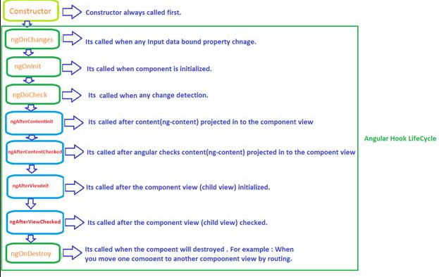

## Principales comandos:

Verifica versión de Node: node -v
Verifica versión de npm: npm -v
Instala el CLI de Angular: npm i -g @angular/cli
Verifica tu instalación: ng version
Crea tu primer proyecto: ng new [project name]
Ejecuta el servidor de desarrollo: ng serve //Dentro de la carpeta de tu proyecto.
ng serve -o // Abre el proyecto automáticamente en el navegador
ng serve --port=[port number] // Especificar el puerto a abrir el servidor


## Estructura de los archivos de Angular:
src: Core de la aplicación
browserlistrc: Especificación de los navegadores soportados
editorconfig: Configuración trabajo en equipo. Se debe tener la extención editorconfig.
tsconfig: configuración de typescript.
angular.json: Configuración de ambientes.
karma.json: correr pruebas unitarias.

Recomendación: instalar Angular language service extension para VSCode.
Recomendación 2: implementar el archivo .nvmrc para especificar la versión en la que se está trabajando.


## String interpolation: 
La forma en la que desde la lógica de nuestro typeScript podemos pasar
datos a renderizar a nuestro template(html). En otras palabras, con las {{ }} podemos usar
typeScript en html.


## PROPERTY/DATA BINDING (props):
- Es una forma de controlar dinamamicamente algunos atributos html para que estos sean renderizados apartir una
string, variable o atributo de un objeto de la capa logica.
- Solo funcionan en una direccion desde la capa logica (conponent.ts) al objeto destino (atributo html), a esto
se le conoce como flujo de datos.
- Debemos vincular los valores del componente a los atributos html, esto logramos encerrando el atributo html
entre “square brakets”.
- Los corchetes [ ] (square brakets) hacen que Angular evalúe el lado derecho de la asignación como una expresión
dinámica. Sin los corchetes, Angular trata el lado derecho como un literal de cadena y establece la propiedad en
ese valor estático.

    <button disabled="false"></button> // dato fijo como string
    <button [disabled]="btnDisabled"></button> //dato dinamico
- A menudo, “interpolation” y “Property Binding” pueden lograr los mismos resultados. Los siguientes pares de
enlaces hacen lo mismo.
```
    <p> is the <i>interpolated</i> image.</p>
    <p> is the <i>property bound</i> image.</p>
```
- Utilice cualquiera de las formas cuando represente valores de datos como cadenas.
- Es preferible el metodo de “interpolation” para facilitar la lectura.
- Al establecer una propiedad de elemento en un valor de datos que no sea una cadena, debe usar “Property Binding”.
- Se recomienda comprender los “Event binding” para entender el flujo de datos de la aplicacion y como este
interactua con “interpolation” y “Property Binding”.


## EVENT BINDING: 
- El Event Binding le permite escuchar y responder a las acciones del usuario, como pulsaciones de teclas,
movimientos del mouse, clics y toques (Atributos HTML y propiedades DOM).
- Para vincular un elemento html a un evento, debemos indicar el nombre del evento entre paréntesis a la
izquierda de un signo igual y el nombre de una funcion entre comillas a la derecha, recuerda indicar que se trata
de una funcion con los parentecis “nameFunction()” .

  <button (click)="onSave()">Save</button>
Usar () en el template html es sinonimo de llamar “addEventListener()”

- Podemos realizar eventos personalizados con “EventEmitter”
- Podemos llamar multiples eventos de la siguiente forma:

  <button (click)="clickEvent()" (mouseenter)="mouseEnterEvent()">Click Me</button>

- Podemos determinar un objetivo de evento de la siguiente manera

  <button (click)="handleClick($event)">Save</button>

- Se recomienda comprender el flujo de datos de la aplicacion y como este interactua con la misma, existen tres
tipos de enlaces:

  - Enlace unidireccional [] para enlazar desde la capa logica (component.ts) a la vista (html).
  - Enlace unidireccional () para enlazar de la vista (html) a la capa logica (component.ts).
  - Enlace bidireccional [()] para enlazar una secuencia de vista bidireccional a la capa logica (component.ts).


## OTROS EVENTOS QUE PUEDES ESCUCHAR
- Una forma común de manejar eventos es pasar el “objeto de evento” $event, donde se capturan eleentos del DOM,
por lo general este evento contiene la informacion que debemos procesar en el metodo.
- Conviene conocer los objetos del evento DOM Event reference.
- Tenga en cuenta el contexto de ejecución.
- Las propiedades de un $event (objeto) varían según el tipo de evento DOM. Por ejemplo, un evento de mouse
incluye información diferente a la de un evento de edición de cuadro de entrada.
- Podemos escuchar el scroll con el siguiente codigo

  //en el html
```
  <div class="box" (scroll)="onScroll($event)"></div>
```
  // en la capa lógica
```
onScroll(event: Event) {
  const element = event.target as HTMLElement;
  console.log(element.scrollTop);
}
```
- Podemos leer las teclas que se estan digitando a medida que estas son digitadas, esto lo hacemos con el siguiente codigo

// en el html
```
  <input type="text" [value]="person.name" (keyup)="onKeyUp($event)" />
  <p>Name {{ person.name }}</p>
```
  // en la capa logica
```
onKeyUp(event: Event) {
  const element = event.target as HTMLInputElement;
  this.person.name = element.value;
}
```
- Use un tipo de datos especifico (no any) que pueda revelar las propiedades del objeto asociado al evento

  // sin informacion de tipo ... simplifica el código al costo de no saber las propiedades del evento
```
  onKey(event: any) {
    this.values += event.target.value + ' | ';
  }
```
  // define un tipo de dato para el evento que estamos capturando, lo que nos permite utilizar las propiedades adecuadas para el objeto
```
onKey(event: KeyboardEvent) {
  this.values += (event.target as HTMLInputElement).value + ' | ';
}
```
  // No todos los elementos tienen una value propiedad, por lo que se convierte target en un elemento de entrada.
    El método onKey expresa más claramente lo que espera y cómo debera interpretar el evento.
- Tambien puedes capturar teclas como Ctr, Alt, Shift y sus conbinaciones
```
  <input (keyup.control)='...respond to ctrl/control...' />
  <input (keyup.alt)='...respond to alt/option...' />
  <input (keyup.shift)='...respond to shift...' />
  <input (keyup.meta)='...respond to command...' />
  <input (keydown.control.shift.z)='...'/>
  <input (keyup.enter)='...responds to enter...' />
  <input (keydown.esc)='...responds to escape...' />
  <input (keyup.shift.f)='...responds to shift+f...' />
```
- Al utilizar el “$event” ten en cuenta que este muestra mas infomacion de la necesaria, lo que rompe:
  “la separacion de responsabilidaes” entre la plantilla ( lo que ve el usuario ) y el componente ( cómo la
  aplicación procesa los datos del usuario ), es mejor usar variables de referencia en la capa logica (componente)
  para abordar este problema.


## ngModel
- Nos permite hacer un binding de doble via, lo que quiere decir que usa string interpolation
y event binding. Se usa para los formularios por lo general por eso para poder usarlo:
1. agregar la siguiente linea de código al archivo modules donde se va a usar:
```
import { FormsModule } from '@angular/forms';
```

2. en el mismo archivo modules en la sección imports agregar el FormsModule
```
  imports: [
    BrowserModule,
    FormsModule,
    AppRoutingModule
  ],
```

LIST OF USEFUL EVENTS IN ANGULAR: https://www.eduforbetterment.com/lists-of-useful-events-types-for-event-binding-in-angular/
NG TEMPLATES: https://profile.es/blog/angular-templates-las-directivas-ng-template-ng-container-y-ngtemplateoutlet/

## Ciclo de vida del componente angular
Los componentes en angular tienen un ciclo de vida que consta de varias etapas, cada una con sus correspondientes 'hooks' de ciclo de vida. Estos 'hooks' le permiten realizar acciones en momentos específicos durante la existencia de un componente. Comprender el ciclo de vida de los componentes es crucial para administrar la inicialización, las actualizaciones y la limpieza de los componentes de manera efectiva.


#### Constructor
El constructor es el primer hook del ciclo de vida que se ejecuta cuando se crea un componente. Se utiliza para inicializar propiedades de clase y se llama solo una vez durante la vida útil del componente.

#### ngOnInit
El hook ngOnInit se llama después de que el componente se haya inicializado y sus propiedades de entrada se hayan vinculado. Es un buen lugar para realizar tareas de configuración inicial que dependen de las entradas de los componentes.

#### ngOnChanges
El enlace ngOnChanges se activa cada vez que cambian las propiedades de entrada del componente. Proporciona información sobre los valores anteriores y actuales de las propiedades de entrada, lo que le permite reaccionar a los cambios.

#### ngAfterViewInit
Se llama al hook ngAfterViewInit después de que se hayan inicializado la vista del componente y las vistas secundarias. A menudo se usa para realizar tareas que necesitan acceso a los elementos DOM.

#### ngAfterViewChecked
El enlace ngAfterViewChecked se ejecuta después de que se hayan verificado los cambios en la vista del componente y las vistas secundarias. Es útil para realizar tareas que necesitan interactuar con el DOM después de cada ciclo de detección de cambios.

#### ngAfterContentInit
El hook ngAfterContentInit se llama después de que se haya producido la proyección de contenido (por ejemplo, ng-content) en el componente. Es un lugar propicio para realizar acciones en base a los contenidos proyectados.

#### ngAfterContentChecked
Se llama al hook ngAfterContentChecked después de que se haya verificado la proyección de contenido para ver si hay cambios. Es útil para realizar tareas que necesitan interactuar con el contenido proyectado después de cada ciclo de detección de cambios.

#### ngOnDestroy
El hook ngOnDestroy se ejecuta justo antes de que se destruya un componente. Le permite liberar recursos, darse de baja de observables y realizar tareas de limpieza para evitar pérdidas de memoria.

### Casos de uso más comunes
##### Constructor:
- Inicializar variables miembro de la clase.
- Configurar valores iniciales para propiedades.
- Realizar tareas de configuración antes de que se cree la vista.
##### ngOnInit:
- Realizar llamadas a servicios para obtener datos iniciales.
- Configurar observables o timers para actualizaciones periódicas.
- Realizar tareas que dependen de los valores iniciales de las propiedades de entrada.
- Suscribirse a eventos para escuchar cambios en el componente.
##### ngOnChanges:
- Realizar acciones basadas en cambios en las propiedades de entrada.
- Actualizar el estado del componente en respuesta a cambios en las propiedades de entrada.
- Realizar tareas adicionales cuando se reciban nuevos datos a través de las propiedades de entrada.
##### ngOnDestroy:
- Liberar recursos, como cancelar suscripciones a observables.
- Cancelar timers o eventos activos para evitar fugas de memoria.
- Realizar tareas de limpieza antes de que el componente se destruya.
- Guardar datos o estado relevante antes de que el componente se elimine.

##### Más información sobre el ciclo de vida de los componentes: 
- https://medium.com/angular-chile/angular-componentes-y-sus-ciclos-de-vida-aa639e13a688
- https://www.youtube.com/watch?v=8lHdqC1GDGs
- https://www.youtube.com/watch?v=Q2pSDeMr5zQ

## Angular routing
En Angular, el enrutamiento es una parte esencial de la creación de aplicaciones de una sola página (Single Page Applications - SPAs). Permite a los desarrolladores definir cómo se debe navegar entre diferentes vistas o componentes en función de la URL actual. Angular Routing facilita la organización y la navegación dentro de la aplicación, brindando una experiencia fluida al usuario.

### Comando del CLI para generar un módulo de enrutamiento
Corre el siguiente comando en la terminal para generar un módulo de enrutamiento en tu aplicación Angular:
```
ng generate module app-routing
```
Esto creará un nuevo módulo llamado app-routing.module.ts en la carpeta src/app. Este módulo contendrá la configuración de enrutamiento de la aplicación.

### Configuración manual del enrutamiento
Para habilitar el enrutamiento en una aplicación Angular, primero debemos configurar las rutas que deseamos utilizar. Esto se puede hacer en el módulo principal de la aplicación, generalmente llamado "AppModule", o en módulos específicos para secciones separadas.

A continuación, se muestra un ejemplo de cómo configurar algunas rutas básicas en el archivo app-routing.module.ts:

```
// app-routing.module.ts

import { NgModule } from '@angular/core';
import { RouterModule, Routes } from '@angular/router';

import { HomeComponent } from './home.component';
import { AboutComponent } from './about.component';
import { ContactComponent } from './contact.component';

const routes: Routes = [
  { path: '', component: HomeComponent },
  { path: 'about', component: AboutComponent },
  { path: 'contact', component: ContactComponent },
];

@NgModule({
  imports: [RouterModule.forRoot(routes)],
  exports: [RouterModule]
})
export class AppRoutingModule { }
```
En este ejemplo, hemos definido tres rutas principales: la ruta raíz '/' apunta al componente HomeComponent, la ruta '/about' apunta al componente AboutComponent y la ruta '/contact' apunta al componente ContactComponent.

### Navegación en el template (html)
Una vez que las rutas están configuradas, podemos utilizar el enrutador de Angular para navegar entre las diferentes vistas en el template de nuestros componentes. Para hacerlo, utilizamos la directiva routerLink en lugar del atributo href convencional para los enlaces.

A continuación, se muestra un ejemplo de cómo utilizar routerLink para navegar a las vistas definidas anteriormente:

```
<!-- app.component.html -->

<h1>Aplicación de Ejemplo</h1>

<nav>
  <a routerLink="/">Home</a>
  <a routerLink="/about">Acerca de</a>
  <a routerLink="/contact">Contacto</a>
</nav>

<router-outlet></router-outlet>
```
En este ejemplo, hemos creado un menú de navegación con tres enlaces que corresponden a las rutas definidas anteriormente. El routerLink se vincula a las rutas y permite que Angular gestione la navegación sin tener que recargar completamente la página.

### Navegación programática
Además de la navegación a través de enlaces en el template, también podemos realizar navegación programática utilizando el servicio Router proporcionado por Angular.

A continuación, se muestra un ejemplo de cómo realizar navegación programática en respuesta a una acción del usuario:

```
// app.component.ts

import { Component } from '@angular/core';
import { Router } from '@angular/router';

@Component({
  selector: 'app-root',
  templateUrl: './app.component.html',
  styleUrls: ['./app.component.css']
})
export class AppComponent {

  constructor(private router: Router) {}

  redirectToAboutPage() {
    this.router.navigate(['/about']);
  }
}
```
En este ejemplo, hemos importado el servicio Router y lo hemos inyectado en el componente. Luego, en el método redirectToAboutPage(), utilizamos el método navigate() del servicio Router para navegar al componente AboutComponent.

### Recibir parámetros en la ruta
En muchas aplicaciones, es necesario pasar parámetros a una ruta, como un identificador único para recuperar datos específicos. En Angular, podemos hacer esto agregando parámetros a la ruta.

A continuación, se muestra un ejemplo de cómo definir una ruta que acepte un parámetro:
```
// app-routing.module.ts

const routes: Routes = [
  { path: 'products/:id', component: ProductDetailComponent },
];
```
En este ejemplo, hemos definido una ruta que incluye el segmento :id. Este segmento es un marcador de posición que se utilizará para pasar el valor del parámetro.

### Leer parámetros de la ruta
Para leer los parámetros pasados en la URL, podemos utilizar el servicio ActivatedRoute proporcionado por Angular.

A continuación, se muestra un ejemplo de cómo leer el parámetro id de la ruta en un componente llamado ProductDetailComponent que como su nombre lo sugiere, su finalidad es mostrar los detalles de un producto especificado por el id de la ruta:

```
// product-detail.component.ts

import { Component, OnInit } from '@angular/core';
import { ActivatedRoute } from '@angular/router';

@Component({
  selector: 'app-product-detail',
  templateUrl: './product-detail.component.html',
  styleUrls: ['./product-detail.component.css']
})
export class ProductDetailComponent implements OnInit {

  productId: number;

  constructor(private route: ActivatedRoute) { }

  ngOnInit() {
    this.productId = +this.route.snapshot.paramMap.get('id');
  }
}
```
En este ejemplo, hemos importado el servicio ActivatedRoute y lo hemos inyectado en el componente. Luego, en el método ngOnInit(), utilizamos this.route.snapshot.paramMap.get('id') para leer el valor del parámetro id.