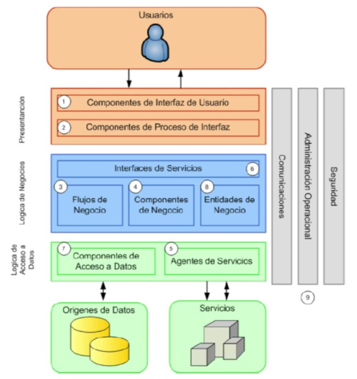

## Fundamentos de JavaScript
### Introducción
JavaScript es un lenguaje de programación que se utiliza principalmente para crear páginas web interactivas. Es un lenguaje de programación de alto nivel, orientado a objetos, dinámico, débilmente tipado y multi-paradigma. Además, es uno de los lenguajes de programación más populares del mundo y se utiliza tanto en el lado del cliente como en el lado del servidor.

### Historia

JavaScript fue creado en 1995 por [Brendan Eich](https://es.wikipedia.org/wiki/Brendan_Eich), un ingeniero de Netscape Communications Corporation. El lenguaje se llamó inicialmente Mocha, pero luego se cambió a LiveScript y finalmente a JavaScript. El nombre JavaScript se eligió para aprovechar la popularidad del lenguaje Java, que era un lenguaje de programación muy popular en ese momento. [Más información](https://es.wikipedia.org/wiki/JavaScript#Historia).


### Características
- **Lenguaje de alto nivel**: JavaScript es un lenguaje de alto nivel, lo que significa que está más cerca del lenguaje humano que del lenguaje de máquina. Esto hace que sea más fácil para los humanos leer y escribir código JavaScript.
- **Orientado a objetos**: JavaScript es un lenguaje de programación orientado a objetos, lo que significa que se basa en el concepto de objetos que contienen datos en forma de campos y métodos que se utilizan para realizar operaciones en estos datos.
- **Dinámico**: JavaScript es un lenguaje de programación dinámico, lo que significa que no es necesario declarar el tipo de una variable antes de usarla. El tipo de variable se determina automáticamente cuando se asigna un valor a la variable.
- **Débilmente tipado**: JavaScript es un lenguaje de programación débilmente tipado, lo que significa que las variables pueden cambiar de tipo en cualquier momento. Por ejemplo, una variable que se inicializa con un valor numérico puede cambiar a un valor de cadena más adelante en el programa.
- **Multi-paradigma**: JavaScript es un lenguaje de programación multi-paradigma, lo que significa que admite diferentes estilos de programación. Por ejemplo, JavaScript admite programación orientada a objetos, programación imperativa y programación funcional.
  
Más información:
- https://www.mytaskpanel.com/javascript-caracteristicas-beneficios-casos/

Mis enlaces recomendados:
- [Mozilla Developer Network (MDN)](https://developer.mozilla.org/es/docs/Web/JavaScript): JavaScript: Documentación completa de JavaScript proporcionada por Mozilla Developer Network. Incluye guías, referencias de API y tutoriales.

- [W3Schools](https://www.w3schools.com/js/): JavaScript: Un recurso popular para aprender JavaScript. Ofrece tutoriales interactivos, ejemplos de código y una referencia completa de las características de JavaScript.

- [JavaScript.info](https://javascript.info/): Un sitio web de aprendizaje de JavaScript que cubre desde los fundamentos hasta temas más avanzados. Proporciona explicaciones claras y ejemplos de código prácticos.

- [Eloquent JavaScript](https://eloquentjavascript.net/): Un libro en línea gratuito sobre JavaScript escrito por Marijn Haverbeke. Es ampliamente recomendado y aborda conceptos de JavaScript de manera profunda y accesible.

- [DevDocs - JavaScript](https://devdocs.io/javascript/): Una referencia rápida y completa de JavaScript que combina la documentación de varias fuentes, como MDN y W3Schools, en un solo lugar.

- [JavaScript Weekly](https://javascriptweekly.com/): Un boletín semanal que recopila las últimas noticias, artículos, bibliotecas y herramientas relacionadas con JavaScript. Es una excelente forma de mantenerse actualizado en el mundo de JavaScript.

## Asíncronismo en JavaScript
### Introducción
El JavaScript es un lenguaje de programación que se ejecuta en un entorno de navegador y, a menudo, realiza tareas que requieren tiempo, como llamadas a API, operaciones de red o acceso a bases de datos. Para evitar bloquear la ejecución del programa mientras espera la finalización de estas tareas, JavaScript utiliza el concepto de asincronismo.

### Callbacks
Los callbacks son una técnica común utilizada en JavaScript para manejar operaciones asíncronas. Un callback es una función que se pasa como argumento a otra función y se ejecuta después de que se complete una operación asíncrona. Esto permite que el programa continúe ejecutando otras tareas mientras espera la respuesta.

javascript:
```
function fetchData(callback) {
  // Simulación de una operación asíncrona
  setTimeout(function() {
    const data = "Datos obtenidos";
    callback(data);
  }, 2000);
}

function handleData(data) {
  console.log(data);
}

fetchData(handleData);
```

Para más información click en los siguientes enlaces:
- https://developer.mozilla.org/en-US/docs/Glossary/Callback_function
- https://www.w3schools.com/js/js_callback.asp
- https://www.youtube.com/watch?v=DaXuPcdKqQ4

### Promesas
Las promesas son una forma más moderna y elegante de manejar el asincronismo en JavaScript. Una promesa representa un valor que puede estar disponible ahora, en el futuro o nunca. Proporciona métodos para manejar los resultados exitosos o los errores de una operación asíncrona.


javascript:
```
// fetchData es una función que devuelve una promesa
function fetchData() {
  return new Promise(function(resolve, reject) {
    // Simulación de una operación asíncrona
    setTimeout(function() {
      const data = "Datos obtenidos";
      resolve(data); // La operación se completó correctamente
      // reject("Error"); // La operación falló
    }, 2000);
  });
}

// Aqui se consume (o manda a ejecutar) la promesa. 
fetchData()
  .then(function(data) {
    console.log(data);
  })
  .catch(function(error) {
    console.log(error);
  });
```
Más información:
- https://developer.mozilla.org/es/docs/Glossary/Promise
- https://developer.mozilla.org/es/docs/Web/JavaScript/Reference/Global_Objects/Promise
- https://developer.mozilla.org/es/docs/Web/JavaScript/Guide/Using_promises
- https://www.w3schools.com/js/js_promise.asp
- https://lenguajejs.com/javascript/asincronia/promesas/

### Async/Await
Async/await es una forma más reciente de manejar el asincronismo en JavaScript. Esta sintaxis utiliza las palabras clave async y await para indicar que una función es asíncrona y para esperar a que se complete una operación asíncrona.

javascript:
```
async function fetchData() {
  return new Promise(function(resolve, reject) {
    // Simulación de una operación asíncrona
    setTimeout(function() {
      const data = "Datos obtenidos";
      resolve(data); // La operación se completó correctamente
      // reject("Error"); // La operación falló
    }, 2000);
  });
}

async function handleData() {
  try {
    const data = await fetchData();
    console.log(data);
  } catch (error) {
    console.log(error);
  }
}

handleData();
```

Más información:

- https://developer.mozilla.org/es/docs/Web/JavaScript/Reference/Statements/async_function
- https://www.youtube.com/watch?v=rKK1q7nFt7M

### Consideraciones
En resumen, JavaScript utiliza callbacks, promesas y async/await para manejar el asincronismo y evitar bloquear la ejecución del programa durante tareas que requieren tiempo. Cada enfoque tiene sus propias ventajas y características, y la elección depende del escenario específico y las preferencias del desarrollador.


## Node.js y el Event Loop
### Introducción a Node.js
Node.js es un entorno de tiempo de ejecución basado en el motor V8 de Google Chrome, que permite ejecutar código JavaScript fuera del navegador. Se ha convertido en una opción popular para el desarrollo de servidores y aplicaciones de red, gracias a su enfoque en el manejo eficiente de operaciones de entrada/salida (I/O) de manera asíncrona.

### Event Loop en Node.js
El Event Loop (bucle de eventos) es una parte fundamental de Node.js y es responsable de la ejecución asíncrona y no bloqueante de operaciones. Proporciona un mecanismo para manejar múltiples tareas de manera eficiente y garantizar un alto rendimiento en aplicaciones con un gran número de operaciones I/O.


El Event Loop de Node.js consta de cuatro componentes principales:

1. Call Stack (Pila de llamadas): Es donde se registran las funciones que están en proceso de ejecución. Cada vez que una función es llamada, se agrega a la parte superior de la pila, y cuando se completa, se retira de la pila.

2. Cola de tareas(Task queue): Aquí se almacenan las funciones que se deben ejecutar después de que se hayan completado las operaciones asíncronas. Cuando una operación asíncrona se completa, la función asociada se agrega a la cola de tareas.

3. Loop (Event loop): Es el corazón del Event Loop. Se encarga de verificar continuamente si la pila de llamadas está vacía. Si la pila está vacía, toma la primera función de la cola de tareas y la agrega a la pila de llamadas para su ejecución.

4. Handlers (Manejadores): Estos son los controladores de eventos que se ejecutan cuando ocurren ciertos eventos, como la finalización de una operación I/O. Cuando un evento se dispara, su manejador asociado se coloca en la cola de tareas para su posterior ejecución por el Event Loop.

### Ventajas del Event Loop de Node.js
El Event Loop de Node.js proporciona varias ventajas importantes:

- Eficiencia y escalabilidad: Al manejar operaciones I/O de manera asíncrona y no bloqueante, Node.js puede manejar un gran número de conexiones concurrentes sin incurrir en un alto consumo de recursos.

- Rendimiento mejorado: La ejecución no bloqueante permite que Node.js aproveche al máximo los recursos del sistema y garantice una respuesta rápida a las solicitudes, lo que resulta en un rendimiento mejorado.

- Facilidad de desarrollo: El enfoque basado en eventos y la programación asíncrona simplifican el manejo de operaciones I/O complejas y evitan la necesidad de lidiar con hilos de ejecución.

### Conclusión
Node.js y su Event Loop son elementos clave para el desarrollo de aplicaciones de red eficientes y escalables. El Event Loop permite la ejecución asíncrona y no bloqueante de operaciones I/O, lo que mejora el rendimiento y la capacidad de respuesta de las aplicaciones. Aprovechar el Event Loop adecuadamente es fundamental para crear aplicaciones eficientes en Node.js.
#### Más información:
- https://developer.mozilla.org/en-US/docs/Web/JavaScript/Event_loop
- https://codigofacilito.com/articulos/nodejs-y-el-event-loop
- https://www.youtube.com/watch?v=NFIJf-3eQNQ
- https://www.youtube.com/watch?v=EsKJlhWs1XY


## Principales Comandos de Node.js
- node [archivo.js]: Ejecuta un archivo JavaScript utilizando Node.js.

- node --version: Muestra la versión de Node.js instalada en el sistema.

- node --help: Muestra la ayuda y la lista de opciones de Node.js.

- npm install: Instala las dependencias de un proyecto basado en Node.js, utilizando el archivo package.json para determinar las versiones y las dependencias necesarias.

- npm start: Ejecuta el script definido como "start" en el archivo package.json.

- npm run [nombre-script]: Ejecuta un script personalizado definido en el archivo package.json con el nombre especificado.

- npm init: Inicia la creación de un nuevo proyecto de Node.js, generando un archivo package.json interactivo para configurar los detalles del proyecto.

- npm install [nombre-paquete]: Instala un paquete de Node.js en el proyecto actual.

- npm uninstall [nombre-paquete]: Desinstala un paquete de Node.js del proyecto actual.

- npm update: Actualiza los paquetes instalados a sus últimas versiones, según las restricciones definidas en el archivo package.json.

- npm list: Muestra una lista de los paquetes instalados en el proyecto actual.

- npm search término: Busca paquetes de Node.js en el registro de npm basado en el término especificado.

- npm publish: Publica un paquete de Node.js en el registro de npm.


Recuerda que estos son solo algunos de los comandos más comunes en Node.js. Node.js y npm proporcionan muchas más funcionalidades y comandos para el desarrollo y la gestión de proyectos de JavaScript.

Más información:
- https://kinsta.com/es/base-de-conocimiento/que-es-npm/
- https://vortexbird.com/comandos-basicos-de-npm/
- https://www.youtube.com/watch?v=cvhgkIddE9g

## Arquitectura y Modelo por Capas
En el desarrollo de software, la arquitectura es una estructura organizativa que define cómo se organiza un sistema y cómo se comunican sus componentes. Uno de los enfoques arquitectónicos comunes es el modelo por capas, que divide una aplicación en capas lógicas para lograr una mayor modularidad y separación de responsabilidades.


### ¿Qué es el Modelo por Capas?
El modelo por capas es una forma de organizar una aplicación en diferentes capas, donde cada capa tiene una función específica y está construida sobre las capas inferiores. Cada capa representa un nivel lógico de abstracción y se comunica con las capas adyacentes.



Arquitectura por capas para la web:


En el esquema anterior:
Controllers = Controladores
Use cases = Lógica de negocio o servicios
entities = Acceso a datos
### Capas comunes en el Modelo por Capas
**Controladores (Controllers):**
Los controladores son responsables de recibir las solicitudes HTTP y enviar las respuestas correspondientes. Son el punto de entrada para las solicitudes de los clientes y manejan la lógica de alto nivel de la aplicación. Los controladores extraen los datos necesarios de la solicitud, llaman a los servicios adecuados y envían las respuestas al cliente. Los controladores generalmente no contienen lógica de negocio compleja, sino que delegan la responsabilidad a los servicios.

**Servicios (Services) o lógica de negocio:**
Los servicios contienen la lógica de negocio de la aplicación. Son responsables de realizar operaciones más complejas, como la manipulación y el procesamiento de datos. Los servicios se utilizan para abstraer la lógica de negocio del controlador y mantenerlo más limpio y fácil de entender. Los servicios pueden interactuar con la capa de acceso a datos para realizar operaciones de lectura/escritura en la base de datos u otros sistemas de almacenamiento. [Más información](https://albertcapdevila.net/logica-negocio-programacion/) y [aqui](https://fourweekmba.com/es/capa-de-l%C3%B3gica-empresarial/).

**Capa de Acceso a Datos (Data Access Layer):**
La capa de acceso a datos es responsable de interactuar con la base de datos u otros sistemas de almacenamiento. Esto puede incluir consultas a la base de datos, almacenamiento en caché, llamadas a API externas, etc. La capa de acceso a datos se encarga de la persistencia y recuperación de los datos necesarios para las operaciones de la aplicación.

### Beneficios del Modelo por Capas
El modelo por capas ofrece varios beneficios:

- **Separación de responsabilidades:** Cada capa tiene una función claramente definida y se encarga de aspectos específicos de la aplicación. Esto facilita el mantenimiento y la evolución de la aplicación, ya que los cambios en una capa no deberían afectar a las demás.

- **Modularidad:** Las capas son módulos independientes que pueden desarrollarse, probarse y reutilizarse de manera aislada. Esto fomenta la reutilización de código y facilita la incorporación de nuevas funcionalidades.

- **Flexibilidad:** Al dividir la aplicación en capas, se pueden modificar o reemplazar capas específicas sin afectar al resto del sistema. Esto permite una mayor flexibilidad y adaptabilidad a medida que evolucionan los requisitos y las tecnologías.

- **Escalabilidad:** Al separar la lógica de negocio de la capa de acceso a datos y de la presentación, se puede escalar cada capa de forma independiente según sea necesario. Por ejemplo,se puede escalar la capa de acceso a datos para manejar una mayor carga de transacciones sin afectar las otras capas.

### Consideraciones adicionales
Es importante tener en cuenta que el modelo por capas es solo uno de los enfoques arquitectónicos disponibles y que su elección depende de los requisitos y las características específicas de cada proyecto. Otros enfoques comunes incluyen la arquitectura de microservicios y la arquitectura orientada a eventos.

Además, es posible que en algunas aplicaciones más pequeñas o menos complejas, se pueda optar por una arquitectura menos estructurada o basada en capas más livianas.

En última instancia, la elección de la arquitectura adecuada debe basarse en un análisis cuidadoso de los requisitos, las necesidades del negocio y las capacidades técnicas disponibles.

La estructura de la aplicación, vista en forma de arbol respecto a archivos y carpetas, podría ser similar a la siguiente:

```
- src
  - controllers/
    - user.controller.js
    - post.controller.js
    - routes.js
  - services/
    - user.service.js
    - post.service.js
  - data/
    - user.data.js
    - post.data.js
- index.js
```
En el archivo **routes.js**, se definen las rutas de la aplicación y se especifica qué controlador y método se deben llamar para cada ruta. Los controladores se encargan de invocar los servicios correspondientes, que a su vez interactúan con la capa de acceso a datos.

El archivo **index.js** es el punto de entrada de la aplicación. Se encarga de inicializar el servidor HTTP y de conectar la aplicación a la base de datos.

La carpeta **src** contiene el código fuente de la aplicación. Los archivos se organizan en carpetas según su función y responsabilidad.

Este enfoque de capas ayuda a separar las responsabilidades y a mantener el código modular y escalable. Además, facilita las pruebas unitarias y la reutilización de código.

Es importante tener en cuenta que la estructura y organización exacta de la aplicación puede variar según las necesidades y preferencias específicas de cada proyecto.
